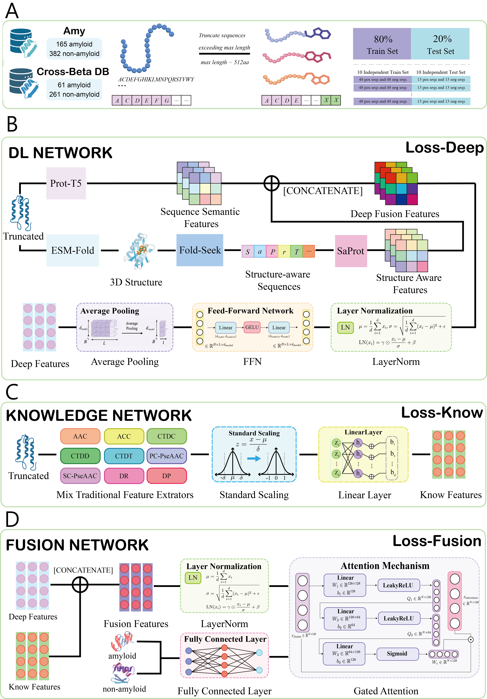
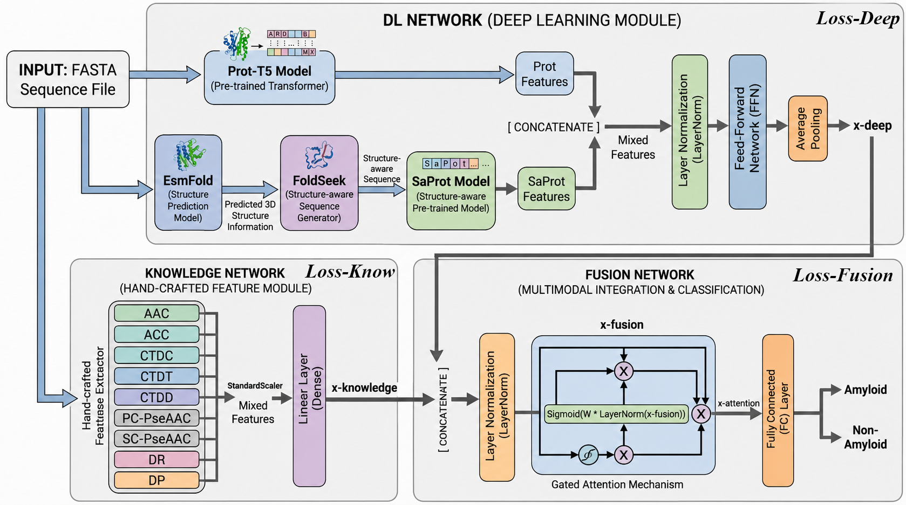

# Amyloid Protein Classification

An end-to-end research pipeline for classifying amyloid-forming protein sequences by combining handcrafted biochemical descriptors, protein language model embeddings, structure-aware SaProt representations, and configurable neural network backbones.

The repository supports training, cross-validation, and independent evaluation on the **Amy** and **Cross_Beta_DB** datasets. Experiments are configured from a single YAML file, and expensive feature representations are cached for reuse.

## Graphical Abstract



## System Overview



## Highlights

-   Three prediction modes: handcrafted knowledge features, learned deep features, or their fusion.
-   Four semantic protein encoders: ProtT5, ProtBERT, ESM-1b, and ESM-2.
-   Structure-aware sequence representations generated with Foldseek and encoded with SaProt.
-   Four deep-feature backbones: feed-forward network (FFN), Mamba, LSTM, and Transformer.
-   Optional attention-based feature fusion and joint-loss training.
-   Reproducible experiment configuration through `config.yaml`.
-   Automatic caching of extracted features and dataset metadata.
-   Saved checkpoints, prediction probabilities, attention weights, loss histories, and UMAP-ready features.

## Workflow

1.  Read positive and negative amino-acid sequences from FASTA files.
2.  Load cached representations or extract the requested features:
    -   handcrafted sequence descriptors;
    -   semantic protein language model embeddings;
    -   SaProt structure-aware embeddings.
3.  Process deep representations with the selected FFN, Mamba, LSTM, or Transformer backbone.
4.  Produce predictions from handcrafted features, deep features, or a fused representation.
5.  Train and evaluate the model, then save metrics and experiment artifacts.

## Repository Structure

```text
.
|-- config.yaml                  # Experiment configuration
|-- main.py                      # Training and evaluation entry point
|-- requirements.txt             # Core Python dependencies
|-- Cross_Beta_DB_test_set/      # Ten independent Cross-Beta test sets
|-- data/
|   |-- aa/                      # Amino-acid FASTA files
|   `-- sa/                      # Structure-aware FASTA files
|-- dataset/                     # Cached dataset metadata and labels
|-- features/                    # Cached handcrafted and PLM features
|-- huggingface/                 # Local pretrained model directories
|-- model/                       # Model checkpoints
|-- SaProt/                      # SaProt implementation and Foldseek binary
|-- src/
|   |-- config.py                # Typed configuration and validation
|   |-- core/                    # Dataset, model, and training logic
|   |-- handcrafted/             # Handcrafted feature extraction
|   |-- plm/                     # PLM and structure extraction
|   `-- utils/                   # Data preparation and evaluation utilities
`-- structures_cif/              # Protein structures used for SA sequences
```

The `saved/` directory is created during execution when attention weights, losses, probabilities, or UMAP features are written.

## Requirements

-   Python 3.10 is recommended.
-   A CUDA-capable GPU is strongly recommended for protein language model feature extraction and model training.
-   Sufficient memory and storage for pretrained model weights, protein structures, and cached feature tensors.
-   Linux is recommended when using the bundled Foldseek executable or CUDA extensions such as Mamba.

The core dependency versions are pinned in `requirements.txt`. The project currently uses PyTorch 2.3.1; optional compiled packages must match the installed Python, PyTorch, CUDA, operating-system, and C++ ABI versions.

## Installation

### Core Environment

Create and activate a Conda environment:

```bash
conda create -n HKDD python=3.10 -y
conda activate HKDD
```

Install the core dependencies:

```bash
pip install -r requirements.txt
```

If your system needs a platform-specific PyTorch build, install the appropriate PyTorch package first and then install the remaining requirements with compatible versions.

### Optional ESMFold/OpenFold Support

ESMFold is used only when protein structures must be generated from amino-acid sequences. It is not required when the necessary CIF structures and structure-aware FASTA files are already available.

OpenFold contains compiled extensions and must be installed against a compatible CUDA toolkit. One reproducible approach is to download the [OpenFold v1.0.0 release](https://github.com/aqlaboratory/openfold/releases/tag/v1.0.0), extract it, and install it locally:

```bash
conda install -c nvidia/label/cuda-11.8 cuda-toolkit -y

export CUDA_HOME="$CONDA_PREFIX"
export PATH="$CUDA_HOME/bin:$PATH"
export LD_LIBRARY_PATH="$CUDA_HOME/lib:$CUDA_HOME/lib64:$LD_LIBRARY_PATH"

cd openfold-1.0.0
pip install --no-cache-dir --no-build-isolation .
pip install einops dm-tree ml-collections omegaconf modelcif
```

CUDA 11.8 is an example environment, not a universal requirement. Select versions that are mutually compatible with your installed PyTorch build and GPU driver.

Verify the installation before generating structures:

```bash
python -c "import esm, openfold, torch; print('ESM/OpenFold imports: OK'); print('CUDA available:', torch.cuda.is_available())"
```

### Optional Mamba Support

The Mamba backbone requires packages that are not included in `requirements.txt`:

-   `causal-conv1d == 1.4.0`
-   `mamba-ssm == 2.2.2`

Install wheels that match your environment from the official release pages:

-   [causal-conv1d v1.4.0](https://github.com/Dao-AILab/causal-conv1d/releases/tag/v1.4.0)
-   [mamba-ssm v2.2.2](https://github.com/state-spaces/mamba/releases/tag/v2.2.2)

After downloading compatible wheel files, install them in dependency order:

```bash
pip install /path/to/causal_conv1d-1.4.0-compatible-wheel.whl
pip install /path/to/mamba_ssm-2.2.2-compatible-wheel.whl
```

Verify the imports:

```bash
python -c "import causal_conv1d, mamba_ssm; print('Mamba dependencies: OK')"
```

If compatible Mamba packages are unavailable, set `model.deep_model` to `ffn`, `lstm`, or `transformer`.

## Pretrained Models

ProtT5, ProtBERT, and SaProt are loaded from local directories with offline loading enabled. Place their tokenizer, configuration, and weight files under `huggingface/`, or update the corresponding paths in `config.yaml`.

Encoder

Default local path

Configuration key

ProtT5

`huggingface/prot/`

`pretrained_models.t5_path`

ProtBERT

`huggingface/bert/`

`pretrained_models.bert_path`

SaProt

`huggingface/saprot/`

`pretrained_models.saprot_path`

Expected layout:

```text
huggingface/
|-- prot/                        # ProtT5 model and tokenizer files
|-- bert/                        # ProtBERT model and tokenizer files
`-- saprot/                      # SaProt model and tokenizer files
```

ESM-1b and ESM-2 are loaded through the `fair-esm` package. If their weights are not already cached, the first extraction may require network access and additional storage.

## Configuration

All experiment settings are defined in `config.yaml`:

```yaml
dataset: Amy
seed: 11113

pretrained_models:
  t5_path: huggingface/prot
  bert_path: huggingface/bert
  saprot_path: huggingface/saprot

model:
  feature_mode: fusion
  use_attention: true
  deep_feature_mode: combined
  semantic_feature_extractor: prot-t5
  deep_model: ffn
  joint_loss: true

training:
  batch_size: 16
  init_learning_rate: 0.005
  epochs: 30
  early_stopping_patience: 10

save:
  model_path: model
  attn_weights_path: saved/attn_weights
  losses_path: saved/losses
  probs_path: saved/probs
  umap_features_path: saved/umap_features
```

Supported values:

Key

Allowed values

Description

`dataset`

`Amy`, `Cross_Beta_DB`

Selects the experiment pipeline.

`model.feature_mode`

`know`, `deep`, `fusion`

Uses handcrafted, deep, or fused predictions.

`model.deep_feature_mode`

`semantic`, `structure`, `combined`

Selects semantic PLM features, SaProt features, or both.

`model.semantic_feature_extractor`

`prot-t5`, `esm-1b`, `esm-2`, `prot-bert`

Selects the semantic encoder.

`model.deep_model`

`ffn`, `mamba`, `lstm`, `transformer`

Selects the deep-feature backbone.

`model.use_attention`

`true`, `false`

Enables attention-based fusion when `feature_mode: fusion`.

`model.joint_loss`

`true`, `false`

Enables joint-loss training when `feature_mode: fusion`.

The save directories are automatically extended with `{dataset}/{seed}`. For example, the default attention output path becomes `saved/attn_weights/Amy/11113/`.

## Running Experiments

Edit `config.yaml`, then run:

```bash
python main.py
```

To use another configuration file:

```bash
python main.py --config path/to/experiment.yaml
```

Runtime messages are printed to standard output and written to `amyloid_classification.log`.

### Amy

Set:

```yaml
dataset: Amy
```

The pipeline performs the following operations:

1.  creates an 80/20 training and independent-test split;
2.  runs 10-fold cross-validation on the training set;
3.  trains a model on the complete training set;
4.  evaluates the saved model on the independent test set.

### Cross_Beta_DB

Set:

```yaml
dataset: Cross_Beta_DB
```

The pipeline trains and evaluates across the ten test sets under `Cross_Beta_DB_test_set/`, then reports their summarized metrics. When `deep_feature_mode` is `structure` or `combined`, structure-aware sequences are regenerated for each test set with Foldseek.

## Datasets and Feature Cache

Amino-acid and structure-aware sequences are stored separately:

```text
data/
|-- aa/
|   |-- Amy/
|   `-- Cross_Beta_DB/
`-- sa/
    |-- Amy/
    `-- Cross_Beta_DB/
```

Each dataset directory contains positive and negative FASTA files. Training and test FASTA files are generated or selected by the experiment pipeline.

Extracted tensors are cached under:

```text
features/{dataset}/{set_number}/{split}/{feature_name}.pt
```

Dataset metadata and labels are cached under `dataset/`. A feature is extracted again when its cache is missing, when it is absent from the metadata, or when the configured seed no longer matches the cached metadata.

For structure-aware experiments, the required SA FASTA files must exist under `data/sa/`. Their source structures are stored under `structures_cif/`, and Foldseek is expected at `SaProt/bin/foldseek`.

## Outputs

The configured output roots are extended with `{dataset}/{seed}`. Depending on the selected mode and available trainer artifacts, a run may create:

Artifact

Default location or name

Model checkpoint

`model/{dataset}/{seed}/model_params.pth`

Attention weights

`saved/attn_weights/{dataset}/{seed}/attn_weights.npy` or `.pkl`

Loss history

`saved/losses/{dataset}/{seed}/losses.npy` or `.pkl`

Prediction probabilities

`saved/probs/{dataset}/{seed}/probs.npy` or `.pkl`

UMAP-ready features

`saved/umap_features/{dataset}/{seed}/umap_features.npy` or `.pkl`

Runtime log

`amyloid_classification.log`

Values that can be represented as regular NumPy arrays are saved as `.npy`; irregular or dictionary-like values are saved as `.pkl`.

## Evaluation Metrics

The evaluation pipeline reports:

-   accuracy;
-   sensitivity/recall;
-   specificity;
-   Matthews correlation coefficient (MCC);
-   area under the ROC curve (AUC);
-   precision;
-   F1 score.

## Troubleshooting

### Local pretrained model cannot be loaded

Confirm that the paths under `pretrained_models` point to complete local Hugging Face model directories. ProtT5, ProtBERT, and SaProt are loaded with `local_files_only=True` and therefore are not downloaded automatically.

### Foldseek produces a missing TSV error

On Linux, ensure that the bundled executable has permission to run:

```bash
chmod +x SaProt/bin/foldseek
```

Run commands from the repository root so that the relative Foldseek and data paths resolve correctly.

### CUDA extension fails to build or import

Check that the Python, PyTorch, CUDA toolkit, GPU driver, compiler, and C++ ABI are compatible. A wheel built for a different combination may install successfully but fail at import time. Use the FFN, LSTM, or Transformer backbone if Mamba is unavailable.

### GPU memory is insufficient

Feature extraction with large protein language models is the most memory-intensive stage. Reuse existing feature caches whenever possible, close other GPU workloads, and ensure that cached features correspond to the requested seed and encoders.

## Reproducibility Notes

-   `main.py` seeds Python, NumPy, and PyTorch from `config.yaml`.
-   CUDA deterministic behavior is enabled when a GPU is available, with warnings permitted for operations that do not provide a deterministic implementation.
-   The default seed is `11113`; the configuration comments also list `22229`, `33343`, `44461`, and `55567` for repeated experiments.
-   Changing the seed can invalidate dataset metadata and trigger feature-cache rebuilding.
-   Keep the configuration file, dependency versions, pretrained model versions, and CUDA environment with each reported experiment.
-   The current configuration comments specify `batch_size: 8` and `init_learning_rate: 0.001` for the paper's Cross_Beta_DB setting; update both values explicitly when reproducing that setting.

## Citation

Citation information has not yet been provided in this repository. If you use this project in academic work, please check future repository releases for the associated publication and recommended citation.

## License

No license file is currently included in this repository. Permission to use, modify, or redistribute the code is therefore not granted by an explicit project license; contact the repository owners before reuse or distribution.